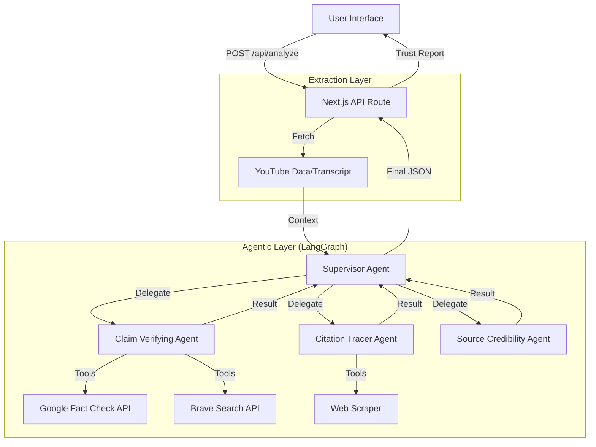

# System Overview

SlopScore.ai uses a multi-agent architecture where specialized
AI agents work in parallel to verify different aspects of
video content.

The architecture follows a `stateless, request-response model`. We do not store user history or require authentication. The system is designed for immediate, real-time analysis.

## High-Level Data Flow

1.  **Input:** User pastes a YouTube URL in the Next.js Frontend.
2.  **Extraction:** The backend fetches the transcript and metadata immediately.
3.  **Orchestration:** A `LangGraph Supervisor` receives the data and delegates tasks to worker agents.
4.  **Parallel Execution:** Agents (Claim Verifier, Citation Tracer) run simultaneously to minimize latency.
5.  **Synthesis:** The Supervisor aggregates the results into a structured JSON object.
6.  **Visualization:** The Frontend renders the Trust Report.

## Architecture Diagram

## Key Design Decisions

- `Edge-Ready Logic`: Where possible, we use lightweight fetching logic compatible with Vercel Edge functions to reduce cold starts.
- `Strict Timeouts`: To ensure the UI doesn't hang, every agent has a hard timeout (e.g., 15 seconds). If an agent fails, the report is generated with partial data rather than crashing.
- `No Persistence`: As per the MVP scope, we are not using a database. Every analysis is fresh.
